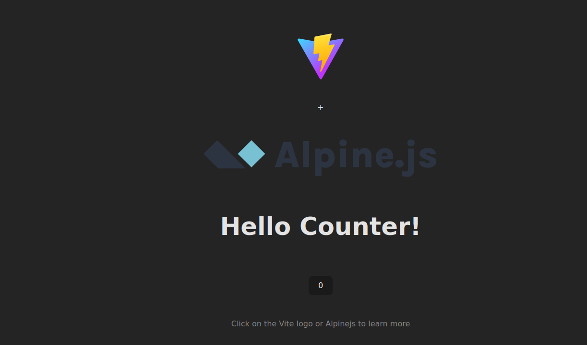

# Vite + Alpinejs template

Template base on vanilla js



## Installation

just clone it and

```bash
npm i

```

for start dev server:

```bash
npm start

```

## more

read the docs of [vitejs](http://vitejs.dev/) and [Alpinejs](https://alpinejs.dev/)
